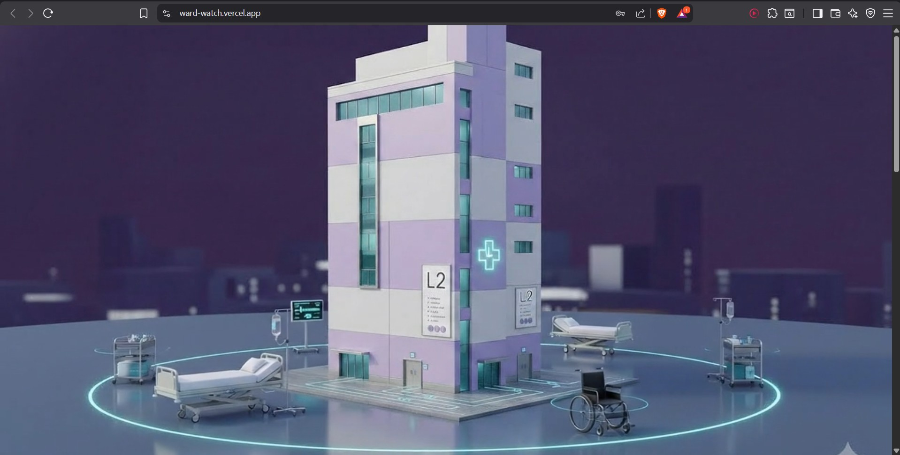
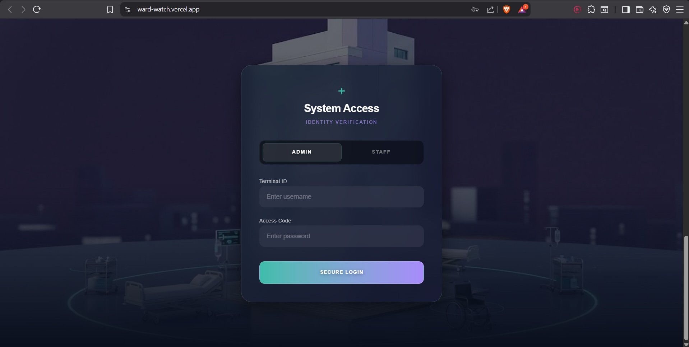
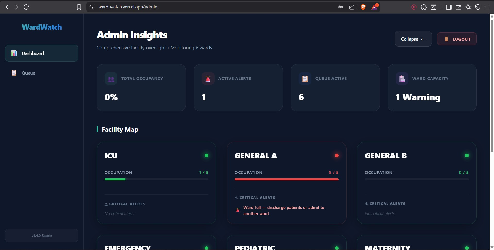
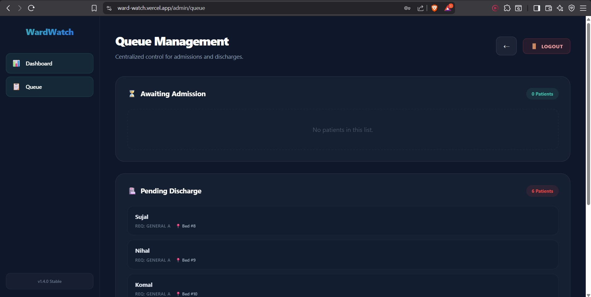
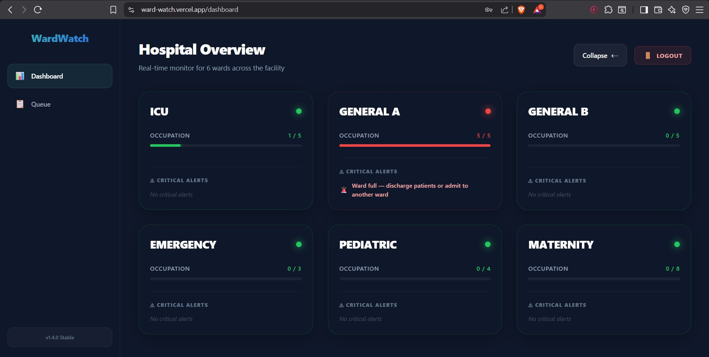
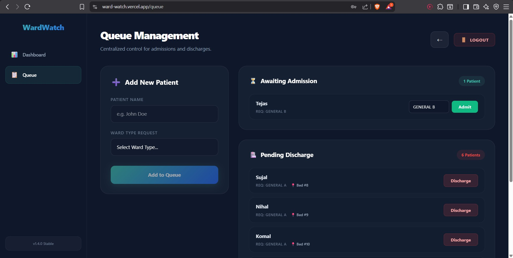

<h1>
  WardWatch |
  <a href="https://ward-watch.vercel.app/" style="font-size: 18px;"> Live Demo</a>
</h1>


<p align="center">
  <b>Know every bed. Every patient. Every second.</b>
</p>


<p align="center">
  
  
  
  
  
</p>

---

## 📌 Overview

WardWatch is a **real-time hospital ward management system** that provides complete visibility into bed availability and patient flow.

Instead of relying on manual registers and delayed updates, WardWatch delivers a **live dashboard** that enables hospital staff to make faster, more accurate decisions.

---

## 🎯 Problem

- No real-time visibility of ward and bed status  
- Information scattered across systems and manual records  
- Delayed discharges blocking bed availability  
- Inefficient bed utilization  
- Decisions based on outdated data  

---

## 💡 Solution

WardWatch provides a **centralized, real-time system** for managing ward operations efficiently.

- Live tracking of bed status  
- Automatic bed allocation and updates  
- Multi-ward monitoring  
- Role-based access control  
- Shift handover summaries (printable)  
- Smart alerts for delays and capacity  

---

## 🖼️ System Preview

### 🔐 Login Screens
<p align="center">
  
  
</p>

---

### 👨‍💼 Admin Dashboard
<p align="center">
  
  
</p>

---

### 👩‍⚕️ Staff View
<p align="center">
  
  
</p>

---

## 🏗️ Architecture

```
Client (Frontend)
        ↓
Spring Boot API Layer
        ↓
Business Logic (Bed Allocation, Queue, Alerts)
        ↓
WebSocket Layer (Real-time Updates)
        ↓
PostgreSQL Database (Local / Supabase)
```


---

## ⚙️ Configuration

### 🔁 Profiles

This project supports multiple environments:

#### ▶️ Local Development
```
spring.profiles.active=local
```

#### ☁️ Production (Supabase)
```
spring.profiles.active=prod
```

---

## 🚀 Running the Project

```bash
# Clone the repository
git clone https://github.com/SujalPatil21/WardWatch.git

# Navigate to project
cd WardWatch

# Run application
./mvnw spring-boot:run
```

---

## 📊 Impact

- ⚡ Faster decision-making  
- 🏥 Improved bed utilization  
- 🔄 Efficient patient flow management  
- 📈 Better operational visibility  

---

## 🔮 Future Enhancements

- AI-based bed prediction  
- Mobile app integration  
- Analytics dashboard  
- Hospital-wide scalability  

---

## 👨‍💻 Author

**Shreya Awari**
**Sujal Patil**
**Tejas Halvankar**


---

⭐ Support

If this project added value, consider starring the repository to support its visibility and development.

---

## 📄 License

This project is for academic and demonstration purposes.
